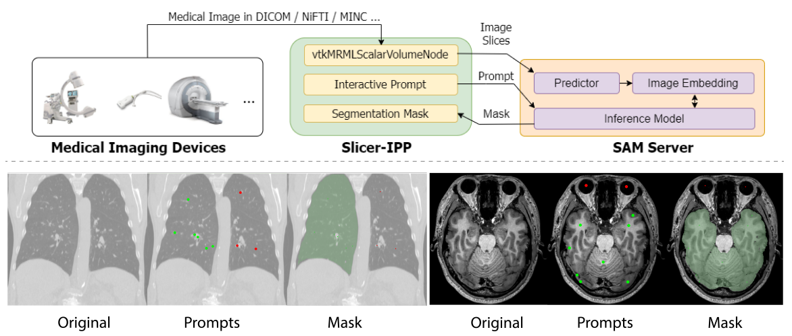
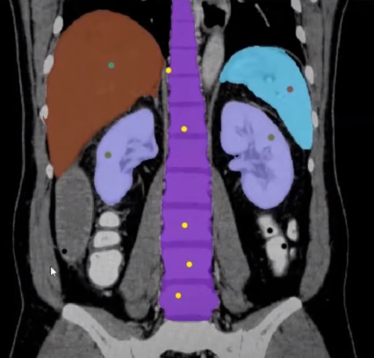
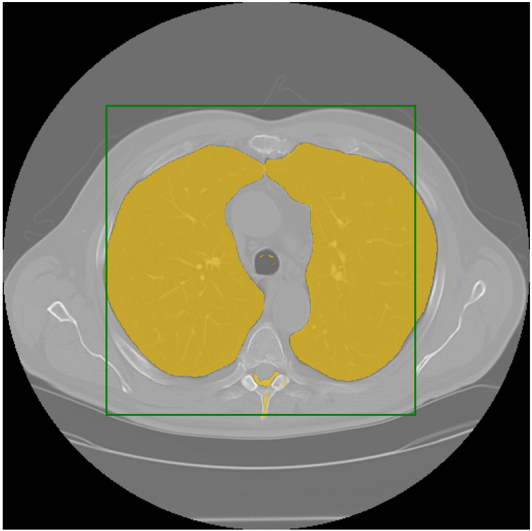
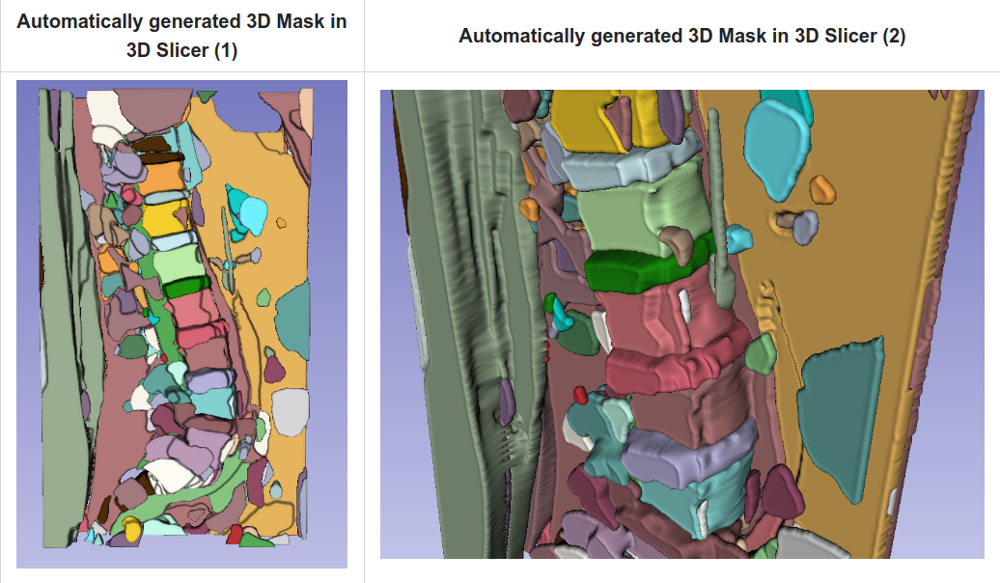

# Awesome-Segment-Anything-Medical-Images

In this repo I try to collect a list of papers and projects that I find interesting that utilizes the **[Segment Anything Model (SAM)](https://github.com/facebookresearch/segment-anything)** to perform segmentation on medical images, utilizes SAM as part of the frameworks, or perform anaylsis or studies of SAM on medical images. Note that this SAM is a relative new model and there may be ignored papers or works that are ignored. 

For a list of all projects and researches of SAM in various fields, check out the [Awesome Segment Anything](https://github.com/Hedlen/awesome-segment-anything) repository.

If you find any interesting works feel free to create pull requests or [*email* me](mailto:knight16729438@gmail.com) to make the list more comprehensive.

### Papers 

| Title                  | Paper                  | Code                                                    | Dataset                                                         | Keywords | Comments                                                     |
| ---------------------- | ---------------------- |  ---------------------- | ------------------------------------------------------------ | ------------------------------------------------------------ | ------------------------------------------------------------ |
|SAM.MD: Zero-shot medical image segmentation capabilities of the Segment Anything Mode |  [arxiv](https://arxiv.org/pdf/2304.05396.pdf) | - | abdominal CT organ | zero-shot | comparasion between prompted SAM and 2D and 3D nnUNet |
| Segment Anything Model (SAM) for Digital Pathology: Assess Zero-shot Segmentation on Whole Slide Imaging |  [arxiv](https://arxiv.org/pdf/2304.04155.pdf) | - | Skin tumor, Skin tissue | zero-shot | comparasion between prompted SAM and SimTriplet 
| When SAM Meets Medical Images: An Investigation of Segment Anything Model (SAM) on Multi-phase Liver Tumor Segmentation |  [arxiv](https://arxiv.org/pdf/2304.08506v1.pdf) | - | Liver Tumor  | zero-shot | comparasion between SAM and UNet 
| SAM vs BET: A Comparative Study for Brain Extraction and Segmentation of Magnetic Resonance Images using Deep Learning |  [arxiv](https://arxiv.org/pdf/2304.04738.pdf) | - | Brain MRI  | zero-shot | brain extraction
|The “Segment Anything” foundation model achieves favorable brain tumor autosegmentation accuracy on MRI to support radiotherapy treatment planning |  [arxiv](https://arxiv.org/abs/2304.07875) | - | Brain MRI  |  | using BraTS 2020 dataset, use promting for SAM
|Accuracy of Segment-Anything Model (SAM) in Medical Image Segmentation Tasks |  [arxiv](https://arxiv.org/abs/2304.09324) | - | Various  |  | Datasets: ACDC, LiTS, Hipp, ISIC, Prostate, LA, BraTS, Pancreas, BUID, Kvasir, CIR. Benchmark Models: U-Net, U-Net++, Attention U-Net, Trans U-Net, UCTransNet, SAM, SAM-Points, SAM-Boxes (3 prompting settings).
|Can SAM Segment Polyps? |  [arxiv](https://arxiv.org/pdf/2304.07583.pdf) | - | Polyp  |  | Utilizes unprompted settings for SAM. Compute S-measure (Sα) score values for the N masks, and the mask with the highest score is selected as the segmentation map.

### Related Projects

| Title                  | Demo                  | Paper |Code                                                    |                      Comments                                                     |
| ---------------------- | ---------------------- |  ---------------------- | ------------------------------------------------------------ | ------------------------------------------------------------ |
|SAMM (Segment Any Medical Model): A 3D Slicer Integration to SAM | | [arxiv](https://arxiv.org/pdf/2304.05622.pdf) | [code](https://github.com/bingogome/samm)  | SAM integration in 3D Slicer for semi-automatic segmentation
|Segment Anything Model (SAM) in Napari | | - | [code](https://github.com/MIC-DKFZ/napari-sam) | SAM integration in 3D Napari for click-based semantic segmentation
|SAM Medical Imaging |  | - | [code](https://github.com/amine0110/SAM-Medical-Imaging) | SAM segmentaiton of DICOM files using [Colab](https://colab.research.google.com/drive/1slN4dnIHGrc_eiUXaa27lRUFNZ9TIwOX?usp=sharing)
|Segment-Anything-Automatically-on-Medical-Image (SAAMI) |  | - | [code](https://github.com/AxDante/SAAMI) | Automatic SAM 3D segmentation mask generation without prompting

